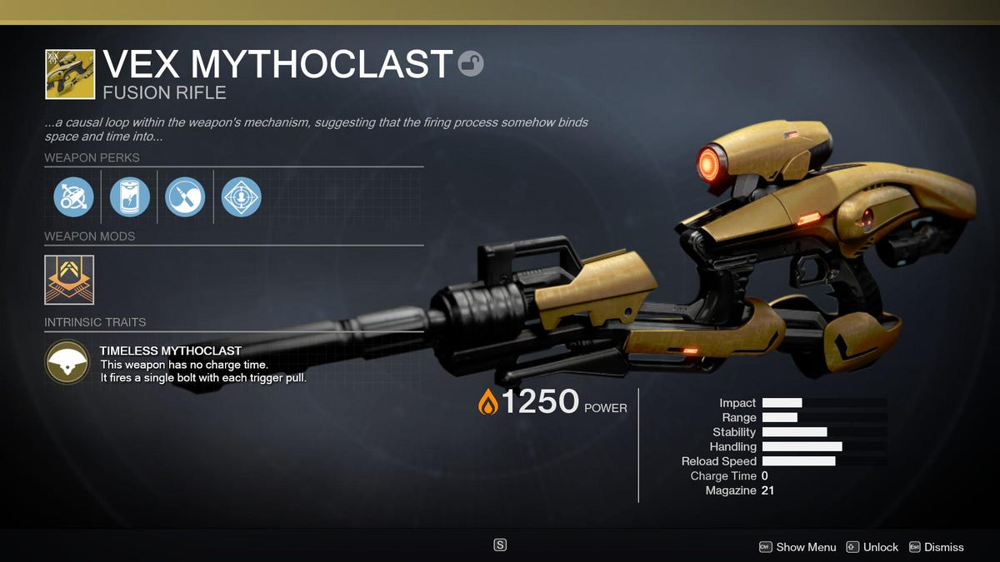
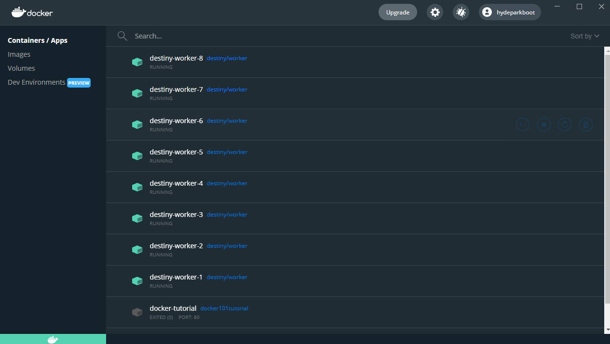
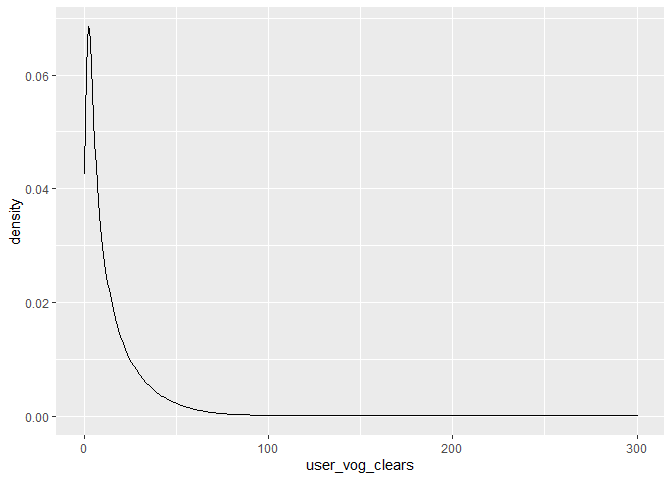
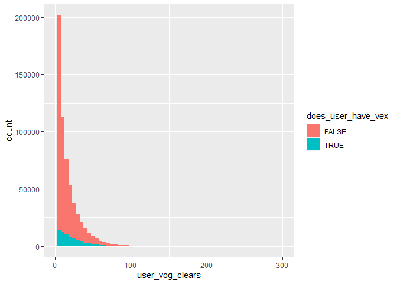
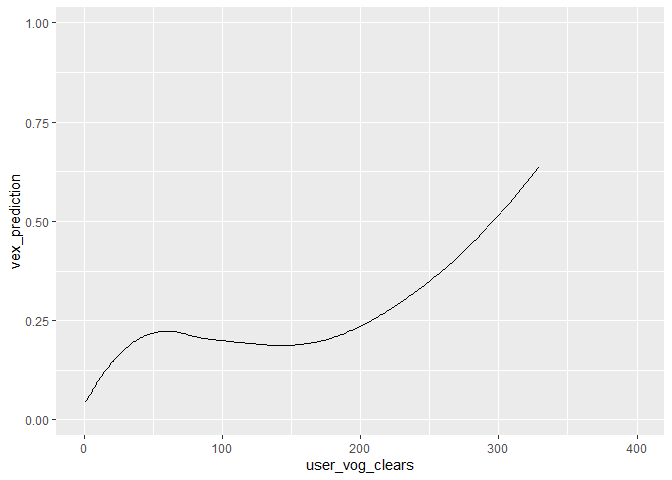

# The Legendary Vex Mythoclast: Containerization for Pseudo-Survival Analysis in R

{:width="80%"}

I've been playing a lot of Destiny 2 lately. It's a fun game in the style of an MMOFPS. You level up, play in 'fireteams' with your friends, and compete in difficult challenges like the player-vs-player (PVP) Crucible or player-vs-enemy (PVE) raids and dungeons.

One of the most challenging PVE raids is called Vault of Glass. Said to be ["the most challenging experience that Bungie has ever created,"](https://www.youtube.com/watch?v=hRRKtkuOeig) even getting past the entrance in this raid can take 45 minutes. Teams of players have to push through a staggering multitude of computer-controlled enemies and punishingly tough bosses. This trial isn't without reward though; upon completion there's a small chance that players receive the legendary Vex Mythoclast weapon.

How small? Well, that's what we're going to figure out.

## Background

This analysis originates from work done by **u/Pinnkeyy** and **u/TBEMystify** on various Destiny subreddits. Both of these analyses were attempts at calculating the drop rate of Vex Mythoclast. The [first attempt](www.reddit.com/r/raidsecrets/comments/pp5zno/vex_mythoclast_drop_rate_survey/) consisted of a survey of Destiny players for how many VoG raids were completed before obtaining the weapon. The [second attempt](www.reddit.com/r/DestinyTheGame/comments/ppmbxu/vex_has_a_5_drop_rate_heres_proof/) was our first step into webscraping, leveraging API tools such as [raid.report](https://raid.report) and [braytech.org](https://braytech.org) in order to obtain higher data volume and reduce the responses bias towards Reddit users.

There are known limitations to both of these prior analyses, primarily due to the sample bias and manual nature of data collection. This made it difficult for either user to obtain truly conclusive evidence for the Vex Mythoclast drop rate. After discussing this with a few members of the **r/DestinyTheGame** community, we recognized an opportunity to query the Bungie API directly to collect a high volume of data.

The below analysis applies **u/TBEMystify**'s method at scale. We utilize HTML scraping and GET request tools in R to source approximately 1 million player records for VoG completions. We then take these records and query them against the Bungie API in a containerized application to determine whether or not the player possesses Vex Mythoclast. Finally, we analyze the likelihood that a player possesses Vex Mythoclast given a particular number of VoG completions. We propose that this relationship can be modeled in the second-order form:

y = Ax^n + Bx + C

where y is the probability of owning Vex Mythoclast, x is the number of Vault of Glass completions, A and B are unknown coefficients, and C is some arbitrary constant. Below is an in-depth explanation of the methodology for this anlaysis and how this model was determined.

## Method

Our first step is similar to **u/TBEMystify**'s method in that we will be accessing [raid.report](https://raid.report) in order to search for players who have completed the Vault of Glass raid at least one time. This was done by browsing through the website while examining my browser's developer tool and looking for the site's data source. Once the source is identified, scraping player records is simply a matter of iterating over HTML requests for pages of 100 players each. Because the first page shows the top leaderboard, our dataset will start with players with the most VoG completions. We'll set an upper limit of one million players (10000 pages of 100 players), as the response volume quickly skyrockets once we get down to five or less completions.



    results_master <- data.frame()

    lowlim <- 0
    uplim <- 10000
    for(n in lowlim:uplim){
    
    skip_to_next <- FALSE
    
        url_stem <- "REDACTED"
        url_page <- as.character(n)
        url_pagesize <- "&pageSize=100"
        
        url_full <- paste0(url_stem,url_page,url_pagesize, sep="")
        
        tryCatch(
        results_temp <- read_html(url_full) %>% 
            html_nodes('body') %>% 
            html_text() %>% 
            list(),
        error = function(e) {skip_to_next <- TRUE})
        if(skip_to_next){next}
        
        results_df <- as.data.frame(fromJSON(results_temp[[1]])$response) %>% 
        select(2,1)

        results_add_page <- data.frame(results_df$entries.destinyUserInfo$displayName,
                                    results_df$entries.destinyUserInfo$membershipId,
                                    results_df$entries.destinyUserInfo$membershipType,
                                    results_df$entries.value,
                                    n)

        results_master <- rbind(results_master, results_add_page
    }

    head(results_master)

        ## # A tibble: 6 x 2
        ##   vog_username   vog_count
        ##   <chr>          <chr>    
        ## 1 Ninjah720      1508     
        ## 2 KING_ANUBIX    1331     
        ## 3 hallowdragonxx 1313     
        ## 4 xSwerve_88     1190     
        ## 5 jollys79       979      
        ## 6 Alan Sparks    977



I have to hand it to **Ninjah720** for completing VoG a whopping *1508* times. That's crazy. And props to the others in this list as well - that's an impressive commitment.

Some of the sharp-eyed among you may notice that certain information is redacted in the above code and output. I'll be scrubbing certain values, strings, and parameters to protect the privacy of both Destiny users and the back-end tools we're utilizing today. This is primarily to ensure that this analysis can only be replicated by someone who knows what they're doing, and to avoid publishing information which could be used maliciously. If you are curious about a certain code chunk, feel free to reach out to me directly to ask about it.

Now that we have obtained our dataset of users and the number of times that a user has completed Vault of Glass, it's time to do some digging. We're going to access the [Bungie.net API](https://github.com/Bungie-net/api) in order to determine whether a particular player owns Vex Mythoclast. This is actually going to be done in two steps:

1. Search a player's username and identify their Member ID - a primary key used to identify their Destiny profile.

2. Query with the Member ID to return that player's Destiny characters and ask for their inventories as a component of the GET request.

Once we obtian the inventories for each player, it's pretty easy to check if they possess Vex Mythoclast. With a little navigating around the API, we can find that the item hash of Vex Mythoclast is **4289226715**. Think of this as a code that tells the Destiny application which item to use anytime an instance of that item is generated in the game. Even though every Destiny character has a unique inventory, every instance should tie back to an original item definition. So we just have to identify if the Vex Mythoclast hash is contained anywhere within any player's characters' inventories.

We quickly run into a problem, however. Our initial pull of records from raid.report was of around one million records. This creates a problem since R is single-threaded and therefore only uses one CPU core at a time. So our script will have to manually make a million API calls and wait for responses before continuing on - that amount of time adds up quickly. A quick estimate on my end was at least *six days* to query all the data, which was unrealistic for my situation.

So what can we do instead? Well, we look into an awesome tool called **Docker** and an underlying technology called *containerization*. Think of it like this: a container holds an entire virutal environment inside of itself that is isolated from the 'host' system it runs on. This environment is always the same no matter where the container is deployed, and so developers can reliably share containers without having to worry about package conflicts. What's more, since each container is so lightweight, they're perfect candidates for running individual 'worker' scripts in R, breaking up a large data transformation into smaller and more manageable chunks. So by configuring a Docker image with the required R packages, imaging our Vex Mythoclast check script into an application, and then running a cluster of instances of that application, we can accomplish the *same* data request in 1/8th of the time. Heck, if I had more RAM, we could do it in 1/16th.

Here's what the pseudo-code looks like for the Bungie API call. It's a lot more complicated than this, but for brevity's sake this is the overall structure. One important thing to note is that the API calls are wrapped inside of TryCatch() - this allows me to skip to the next row `n` without writing an erroneous row to the output. This way the only players who are actually captured are those who *could* be linked to an account on the BungieAPI, and that should help eliminate some false negatives.



    for (n in lower_limit:upper_limit){
    user_member_id <- func_search_for_player(vog_data$vog_username[n]) #First API call

    user_characters <- func_lookup_players_characters(user_member_id) #Second API call

    if (vex_hash %in% user_characters$inventories){
        does_user_have_vex <- TRUE
    } else {
        does_user_have_vex <- FALSE
    }
    
    vog_data$vex_check <- does_user_have_vex
    }



The next challenge was to create a DockerFile and image a container, which was a brand new challenge for me. But I pushed forward and found a helpfule online resource to create my container structure around. Here's the DockerFile text for it:



    # Base image https://hub.docker.com/u/rocker/
    FROM rocker/tidyverse

    ## create directories
    RUN mkdir -p /01_data
    RUN mkdir -p /02_code
    RUN mkdir -p /03_output

    ## copy files
    COPY ./01_data/results_master_combined.csv /app/results_master_combined.csv
    COPY ./02_code/install_packages.R /02_code/install_packages.R
    COPY ./02_code/master.R /02_code/master.R

    ## Install packages
    RUN Rscript /02_code/install_packages.R

    ## run the script
    CMD Rscript /02_code/master.R



The only unfortunate inefficiency here was that I ended up having to manually adjust `lower_limit` and `upper_limit` for each instance of the script I wanted to create, which was a little tedious. If anyone knows how to pass input values from the host system into a container during its initial spin-up, let me know - I haven't quite gotten that figured out. Still, a few minutes of set-up sets us up with eight `destiny/worker` containers, happily spinning away and scarping.

Here's what my Docker Desktop looked like for about 36 hours:

{:width="80%"}

And here's one of the workers chugging away (usernames have been scrubbed for privacy):

{:width="80%"}

One of the nice things about Docker is that the containers mount your hard drive folders as a clone of folders inside the container. This means that you can start running analysis on the data even as it's still in-the-air and updating every few rows. So even before I'd finished the data request, I was already analyzing the incoming Vex Mythoclast data and building my visualizations - including this report!

Here's the last bit of code to get us our completed dataset:



    files <- list.files(path = "docker_output/")
    f <- list()
    for (i in 1:length(files)) {
    f[[i]] <- read.csv(paste0("docker_output/",files[i]), header = T, sep = ",")
    }

    output_combined <- data.frame()

    #colnames(output_combined) <- c("process_number", "n_characters", "user_name", "user_vog_clears", "does_user_have_vex")

    for (i in 1:length(f)){
    output_combined <- rbind(output_combined, f[[i]])
    }

    head(output_combined)

    ##   X n   user_name user_vog_clears does_user_have_vex
    ## 1 1 3   Ninjah720            1508               TRUE
    ## 2 2 3 KING_ANUBIX            1331               TRUE
    ## 3 3 3  xSwerve_88            1190               TRUE
    ## 4 4 3    jollys79             979               TRUE
    ## 5 5 3 Alan Sparks             977              FALSE
    ## 6 6 3    C_J_Mack             967              FALSE



First, let's take a look at the response volume by the number of VoG clears:

{:width="80%"}

I adjusted the axes here to limit us between 0 and 300 VoG clears. Even though the higher outliers are impressive, these limits seem more interesting to me to analyze.

As expected, our response volume appears to resemble the classic **Pareto distribution**. This makes sense, as we should see an increased fequency of responses as we lower the number of VoG clears required. One thing to note is that our front end of the distribution is slightly cut-off; this is simply due to the arbitrary limit of the top million players from raid.report. If we queried for every user who had ever completed Vault of Glass, our distribution would likely fill in and match a Pareto even more closely.

Next, let's take a look at a histogram of the responses with fill color corresponding to whether the user possesses Vex or not:



    ggplot(output_combined, aes(x = user_vog_clears, fill = does_user_have_vex)) +
    geom_histogram(binwidth = 5) +
    scale_x_continuous(limits = c(0, 300))



{:width="80%"}

Hmm... it's a little hard to see what's going on as the number of VoG clears increases. Let's adjust the histogram position to 'fill':



    ggplot(output_combined, aes(x = user_vog_clears, fill = does_user_have_vex)) +
    geom_histogram(binwidth = 5, position = "fill") +
    scale_x_continuous(limits = c(0, 300))



{:width="80%"}

That's a bit better. What's interesting is that we seem to see a smooth increase in Vex possession up until around 100 VoG clears, and then the possession rate varies wildly. Let's look a little closer at this by calculating the percentage of Vex possession for a scatter plot against VoG clears:



    output_combined %>% 
    group_by(user_vog_clears) %>% 
    summarise_at(vars(does_user_have_vex),
                list(avg_drop = mean)) %>% 
    ggplot(aes(x = user_vog_clears, y = avg_drop)) +
    geom_point() +
    #  geom_smooth() +
        scale_x_continuous(limits = c(0,400)) +
        scale_y_continuous(limits = c(0.01, 0.99))



{:width="80%"}

*Here we go.* There appears to be a clear heterskedacity to this data. That makes sense as well - as the number of VoG clears increases, the frequency of player responses drops drastically and our smaples become more subject to extreme variation. Conversely, as the number of VoG clears decreases, we see an increase in frequency of player responses creating a regression to the mean. This means **our model will be most accurate close to the origin** and become less accurate as VoG clears increases. Lets go ahead now and calculate out our local regression model.



    output_limited <- output_combined %>% 
    filter(user_vog_clears < 400) %>% 
    group_by(user_vog_clears) %>% 
    summarise_at(vars(does_user_have_vex),
                list(avg_drop = mean)) %>% 
    filter(avg_drop > 0.01,
            avg_drop < 0.99)

    #output_limited[is.infinite(output_limited$log_avg_drop)] <- NULL

    weights <- output_combined %>% 
    filter(user_vog_clears < 400) %>% 
    group_by(user_vog_clears) %>% 
    count()

    logit_model <- loess(avg_drop ~ user_vog_clears,
                    data = output_limited,
                    degree = 2,
                    span = 0.75,
                    weights[output_limited$user_vog_clears, ]$n
                    )

    ## Call:
    ## loess(formula = avg_drop ~ user_vog_clears, data = output_limited, 
    ##     weights = weights[output_limited$user_vog_clears, ]$n, span = 0.75, 
    ##     degree = 2)
    ## 
    ## Number of Observations: 233 
    ## Equivalent Number of Parameters: 4.42 
    ## Residual Standard Error: 0.886 
    ## Trace of smoother matrix: 4.82  (exact)
    ## 
    ## Control settings:
    ##   span     :  0.75 
    ##   degree   :  2 
    ##   family   :  gaussian
    ##   surface  :  interpolate      cell = 0.2
    ##   normalize:  TRUE
    ##  parametric:  FALSE
    ## drop.square:  FALSE

    summary(logit_model)



Now we get to do some cool stuff by using our model to create a set of Vex Mythoclast possession predictions by VoG clears.



    pred_data <- with(output_limited, data.frame(user_vog_clears = user_vog_clears)) %>%
    drop_na() %>% 
    filter(user_vog_clears %in% logit_model$x)

    pred_data$vex_prediction <- predict(logit_model, pred_data = pred_data, type = "response")

    pred_data_unique <- unique(pred_data) #Saves a ton of space/prevents overplotting

    pred_data_unique %>% 
    ggplot(aes(user_vog_clears, vex_prediction)) +
    geom_line() +
    scale_x_continuous(limits = c(0, 400)) +
    scale_y_continuous(limits = c(0.01, 0.99))



{:width="80%"}

This plot shows us the predicted percentage of Vex Mythoclast ownership in the population by the number of a user's VoG clears. Even better, we can ask the model for its prediciton for a player who's completed VoG once by going to the end of the table:



    ##   user_vog_clears vex_prediction
    ## 1               1     0.04288515



Which reveals that our model predicts that a single completion of Vault of Glass offers a 4.290% chance of obtaining Vex Mythoclast. This is about what we would expect given prior predictions.

Now that we have our model and have thoroughly inspected the Vex Mythoclast dataset, lets finish off by creating a fun ggplot visualization combining what we generated today.

{:width="75%"}

We'll save this plot and use it to post on the subreddit!

There are a few limitations to this analysis worth pointing out.

First, our data collection is limited to the top million rows of players who have completed VoG. As we pointed out before, this means we aren't collecting the entire dataset on the numerous players who have completed VoG one time, only a subset of those players.

A more severe analysis problem has to do with the design of the BungieAPI, which won't return players' character inventories if they are designated as 'private' in the Bungie database. This is why we include a term with an unknown coefficient in our model, which is designed to account for players who do not allow their inventories to be queried. That likely explains some of our high variation as VoG clears increases; we predict that many of these players *do* actually possess Vex Mythoclast, but a certain percentage of them have private inventories.

Unfortunately, there's not a whole lot we can do to resolve this without obtaining data on how many players within Desting 2 maintain a private inventory. This step of the analysis is beyond our currenty scope, but would be worth investigating later.

## Conclusion

We conlcude that the likelihood of obtaining Vex Mythoclast per run of Vault of Glass is approximately 4.290%, with the caveat that this determination is likely under-representative of the player population which allows for public queries of their character inventory. Therefore we suspect the actual value of the Vex Mythoclast drop rate is likely closer to 5%.